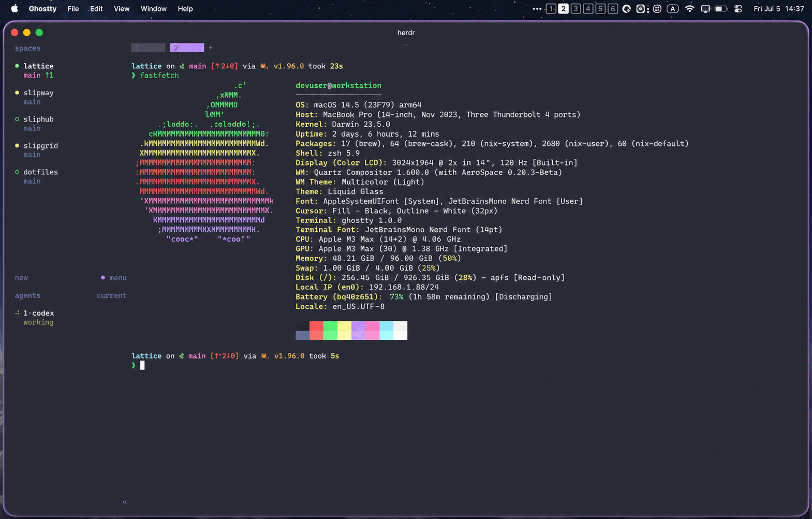
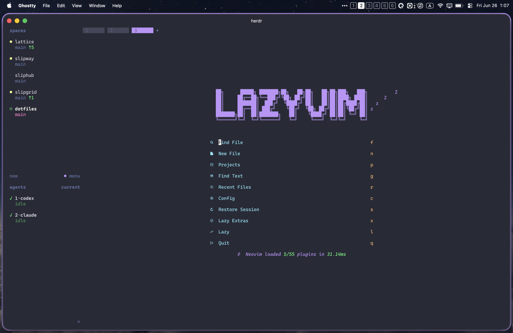

<div align="center">


<p>
  <a href="https://github.com/signalridge/dotfiles/actions/workflows/ci.yml"></a>&nbsp;
  <a href="https://opensource.org/licenses/MIT"></a>&nbsp;
  &nbsp;
  
</p>

<p>
  <a href="https://github.com/twpayne/chezmoi"></a>&nbsp;
  <a href="https://github.com/LnL7/nix-darwin"></a>&nbsp;
  <a href="https://www.anthropic.com/claude-code"></a>&nbsp;
  <a href="https://openai.com/index/introducing-codex/"></a>&nbsp;
  <a href="https://brew.sh/"></a>
</p>

[English](README.md) | [中文](README.zh-CN.md) | [日本語](README.ja.md)

[](https://git.io/typing-svg)

<p>
  
  
</p>

</div>

---

## What This Repo Is

A reproducible personal workstation setup built around:

- `chezmoi` for dotfiles, templating, and bootstrap orchestration
- `Nix` for declarative packages (`nix-darwin` on macOS + `flakey-profile` on macOS/Linux)
- `aqua` + `mise` for CLI/runtime management outside Nix where practical
- Shared AI tooling for `Claude Code` and `Codex CLI`

This is a real daily-driver setup, not a demo template. The README focuses on what is actually implemented in this repository today.

---

## Highlights

- Unified bootstrap pipeline (`.chezmoiscripts/00..20`) with idempotent post-apply maintenance
- Cross-platform package strategy:
  - Nix user packages on macOS/Linux
  - nix-darwin system config on macOS
  - Homebrew/MAS integration on macOS
- Shared AI skills marketplace sync to `~/.harnesses/skills` outside Codex auto-discovery
- Multi-provider account switching for managed wrappers:
  - `claude-manage` / `claude-with`
  - `codex-manage` / `codex-with`
- Auto tool-integration and Herdr agent-integration sync on every `chezmoi apply`
- Automated dependency upkeep via GitHub Actions (versions, flake locks, aqua packages)

---

## Why This Repo

- **Profiles everywhere**: `.chezmoidata/` drives `shared` / `work` / `private` packages across Nix, Homebrew, and MAS
- **End-to-end bootstrap**: staged scripts from `00` to `20` keep setup deterministic and composable
- **macOS polish**: nix-darwin system defaults, Homebrew + MAS integration, post-apply maintenance scripts
- **Workflow guardrails**: pre-commit checks + Claude hooks to reduce risky edits and command misuse
- **DX automation**: Justfile routines, fzf navigation helpers, AI-assisted commit flows
- **CI parity**: template rendering and `nix flake check` on macOS + Linux matrix
- **Dual AI stack**: Claude Code and Codex CLI are managed declaratively in one repo

---

## Motivation

Setting up a new development machine is tedious: dozens of packages to install, many tools to configure, and years of shell/runtime tweaks to remember.

This repository solves that with a declarative baseline and practical bootstrap pipeline, so one repo can recreate a working environment across machines with predictable outcomes.

Core principles:

- **Reproducibility**: same setup logic, same versioned data, repeatable outcomes
- **Declarative first**: package and tool configuration lives in tracked YAML/templates
- **Modular profiles**: work/private/headless behavior is data-driven, not hardcoded forks
- **AI-augmented workflows**: managed prompts, hooks, skills, and provider switching
- **Security layering**: separate mechanisms for dotfile secrets, password store, and key backups

---

## Table of Contents

- [Quick Start](#quick-start)
- [First Run Prompts](#first-run-prompts)
- [Architecture](#architecture)
- [Repository Map](#repository-map)
- [Bootstrap Flow (What Actually Runs)](#bootstrap-flow-what-actually-runs)
- [Daily Operations](#daily-operations)
- [Claude Code Integration](#claude-code-integration)
- [AI Tooling (Claude + Codex)](#ai-tooling-claude--codex)
- [Tool Chains](#tool-chains)
- [Shell Functions](#shell-functions)
- [Package Management](#package-management)
- [Multi-Profile Configuration](#multi-profile-configuration)
- [Security & Secrets](#security--secrets)
- [CI and Automation](#ci-and-automation)
- [Additional Docs](#additional-docs)
- [Acknowledgements](#acknowledgements)
- [Stats](#stats)
- [License](#license)

---

## Architecture

This repository combines `chezmoi` templating with Nix-based package management and AI tooling overlays:

- `chezmoi`: source-of-truth orchestration for scripts/templates
- `nix-darwin` (macOS): system-level configuration
- `flakey-profile` (macOS/Linux): user package profile
- `aqua` + `mise`: CLI/runtime tooling layer outside Nix where needed
- `dot_claude` + `dot_codex`: tool-specific global guidance and configuration

| Component     | macOS          | Linux          |
| ------------- | -------------- | -------------- |
| Dotfiles      | chezmoi        | chezmoi        |
| System Config | nix-darwin     | N/A            |
| User Packages | flakey-profile | flakey-profile |
| GUI Apps      | Homebrew/MAS   | N/A            |

---

## Repository Map

```text
.
├── .chezmoidata/
│   ├── nix.yaml                # Nix package sets (shared/work/private)
│   ├── homebrew.yaml           # Homebrew taps/brews/casks/MAS apps
│   ├── claude.yaml             # Claude provider + account model settings
│   ├── versions.yaml           # Pinned tool/plugin revisions
│   ├── aerospace.yaml          # Aerospace WM data
│   └── hammerspoon.yaml        # Hammerspoon data
├── .chezmoiscripts/            # Bootstrap + maintenance pipeline (00..20)
├── nix-config/
│   ├── flake.nix.tmpl
│   └── modules/
│       ├── system.nix.tmpl     # nix-darwin system config
│       ├── apps.nix.tmpl       # Homebrew + MAS wiring
│       ├── profile.nix.tmpl    # flakey-profile package profile
│       └── host-users.nix
├── dot_local/bin/              # CLI wrappers (Claude/Codex/keys/MCP)
├── dot_claude/                 # Claude global instructions/hooks/templates
├── dot_codex/                  # Codex global instructions/config/prompts
├── private_dot_config/         # Tool configs (tmux, mise, aqua, gopass, ...)
├── docs/                       # Focused guides
└── tests/                      # Bootstrap/script regression tests
```

---

## Bootstrap Flow (What Actually Runs)

The `chezmoi` script chain is staged and numbered:

1. `00` install Nix (Determinate installer with arch/mirror detection)
2. `01` optionally restore encrypted keys-manage files (`useEncryption=true`)
3. `02` macOS: apply nix-darwin system configuration
4. `03` switch flakey-profile package profile
5. `04` install pinned aqua installer/version
6. `05` install tools from `private_dot_config/aquaproj-aqua/aqua.yaml` (including `mise`)
7. `06` bootstrap gopass store (interactive clone)
8. `07` install runtimes/tools via aqua-managed `mise`
9. `08` install pinned nix-index database
10. `09` macOS: install/update Paperlib
11. `10` periodic Homebrew update/upgrade (7-day interval)
12. `11` sync Claude integration plugins
13. `12` sync Claude MCP servers
14. `13` sync Codex connector plugins
15. `14` sync Herdr integrations for Claude, Codex, and Pi
16. `15` install/update Cursor Agent CLI
17. `16` work profile: install Azure Functions Core Tools
18. `17` macOS GUI: reload managed LaunchAgents
19. `18` sync Herdr plugins
20. `19` Linux: reload systemd user units
21. `20` reconcile Pi extensions once per ISO calendar week/package set (failures retry on the next apply)

---

## Quick Start

> [!WARNING]
> This repository modifies shell, package managers, and system settings.
> Fork and review before running on a machine you care about.

### Option 1: Download `init.sh` then run interactively

```bash
curl -fsSL https://raw.githubusercontent.com/signalridge/dotfiles/main/init.sh -o /tmp/init.sh
sh /tmp/init.sh
```

> Why not `curl … | sh`?
> `chezmoi init` prompts for hostname, GitHub username, email, etc.
> Piping into `sh` detaches stdin from your terminal, so those prompts have nothing to read from and the install bails out (or worse, would silently write placeholder values). Download first, then run — `sh /tmp/init.sh` keeps your TTY attached.

### Option 2: Pin to a tag/branch and review first

```bash
REF="<tag-or-branch>"
curl -fsSLo init.sh "https://raw.githubusercontent.com/signalridge/dotfiles/${REF}/init.sh"
shasum -a 256 init.sh || sha256sum init.sh
sh init.sh --ref "${REF}"
```

### Option 3: Clone and run locally (best auditability)

```bash
git clone https://github.com/signalridge/dotfiles.git
cd dotfiles
git checkout <tag-or-commit>
./init.sh
```

### Useful `init.sh` flags

```bash
./init.sh --repo signalridge/dotfiles
./init.sh --ref v1.2.3
./init.sh --depth 1
DOTFILES_USE_ENCRYPTION=false ./init.sh
```

---

## First Run Prompts

`chezmoi` data prompts include:

- `work` (work machine switch)
- `headless` (container/server without full desktop assumptions)
- `useEncryption` (enable encrypted key restore flow)
- `installMasApps` (macOS App Store apps)
- `claudeProviderAccount` / `codexProviderAccount`

For most first-time users of this repo: keep `useEncryption = false` unless you have your own keys-manage backup repo and key material.

> First-run is interactive. Identity prompts (`hostname`, `gitUsername`, `gitEmail`) have no safe default and will hard-fail if there's no TTY — use Option 1's download-then-run pattern, not pipe-to-sh. On a re-apply where `~/.config/chezmoi/chezmoi.toml` already has these values, prompts are skipped; `DOTFILES_USE_ENCRYPTION=true|false` lets you override the encryption flag from the environment in that case.

---

## Daily Operations

The generated global Justfile lives at `~/.config/just/.justfile`.

### Chezmoi

```bash
just apply
just diff
just update
just re-add
```

### Nix

```bash
just up
just upp nixpkgs
just gc
just verify
just optimize
```

### macOS (`nix-darwin`)

```bash
just darwin
just darwin-check
just darwin-build
```

### Tests

```bash
bash tests/run.sh
pre-commit run --all-files
```

---

## Claude Code Integration

### Plugin System

Skills are synced via `.chezmoiexternal.toml.tmpl` from:

- broad engineering packs such as [wshobson/agents](https://github.com/wshobson/agents), [anthropics/skills](https://github.com/anthropics/skills), and [openai/skills](https://github.com/openai/skills)
- platform/vendor packs from Hugging Face, Cloudflare, Vercel, Supabase, Expo, Microsoft, and selected community repos
- language suites for Go, Rust, Swift, TypeScript/JavaScript, and Zig
- social, writing, and media skills including `xurl`, `x-create`, `daily.dev`, Reddit, Remotion, and Humanizer variants (`humanizer-en`, `qu-ai-wei`, `humanizer-ja`)

They are normalized into `~/.harnesses/skills` as a shared library; use `skill-activate` from a project directory to curate active symlinks in `./.claude/skills`, `./.codex/skills`, `./.pi/skills`, `./.cursor/skills`, and `./.kimi-code/skills` (Cursor CLI reads `./.cursor/skills` natively and follows symlinked skill folders; Kimi Code auto-discovers `./.kimi-code/skills`). `skill-activate --category typescript` activates a whole category for the current directory, `skill-activate --sync` repairs partial pairs across the harness dirs, and `Ctrl-A` toggles the highlighted category in the picker.

### Quality Protocols

The managed instruction stack includes explicit quality discipline patterns (for example: pre-implementation confidence checks and evidence-first verification after implementation), primarily delivered via shared skills and project-level guardrails.

### Provider Management

`claude-manage`, `claude-with`, and `claude-token` provide account switching and provider/account-scoped model routing from `.chezmoidata/claude.yaml` + gopass-backed keys.

See: `docs/claude-provider.md`.

### Hooks

Claude hooks in `dot_claude/hooks/` provide workflow guardrails and formatting automation, including:

- `block-git-rewrites.sh`
- `format-code.sh`
- `format-python.sh`

---

## AI Tooling (Claude + Codex)

### Shared Skill Distribution

`chezmoi external` syncs selected skills from:

- broad engineering packs (`wshobson/agents`, `anthropics/skills`, `openai/skills`)
- platform/vendor packs (Hugging Face, Cloudflare, Vercel, Supabase, Expo, Microsoft, and selected community repos)
- language suites for Go, Rust, Swift, TypeScript/JavaScript, and Zig
- product-management skills from `phuryn/pm-skills` for discovery, strategy, execution, GTM, analytics, and AI shipping
- social, writing, and media skills including `xurl`, `x-create`, `daily.dev`, Reddit, Remotion, and Humanizer variants (`humanizer-en`, `qu-ai-wei`, `humanizer-ja`)

They are normalized into `~/.harnesses/skills` as a shared library; use `skill-activate` from a project directory to curate active symlinks in `./.claude/skills`, `./.codex/skills`, `./.pi/skills`, `./.cursor/skills`, and `./.kimi-code/skills` (Cursor CLI reads `./.cursor/skills` natively and follows symlinked skill folders; Kimi Code auto-discovers `./.kimi-code/skills`). `skill-activate --category typescript` activates a whole category for the current directory, `skill-activate --sync` repairs partial pairs across the harness dirs, and `Ctrl-A` toggles the highlighted category in the picker.

### Account + Provider Control

```bash
# Claude
claude-manage
claude-manage list
claude-manage switch anthropic
claude-with kimi@private -- --resume

# Codex
codex-manage
codex-manage list
codex-manage switch openai
codex-with deepseek@private "explain this file"
```

### Token Helpers

```bash
claude-token --check kimi@private
codex-token --check deepseek@private
```

### Tool Integration

- Claude MCP entries are reconciled by `.chezmoiscripts/run_after_12_sync-claude-mcp.sh.tmpl`.
- Claude Notion/Slack integrations are installed as official plugins by `.chezmoiscripts/run_after_11_sync-claude-integration-plugins.sh.tmpl`.
- Codex Slack is installed as the official connector plugin by `.chezmoiscripts/run_after_13_sync-codex-connector-plugins.sh.tmpl` and enabled as `slack@openai-curated`.
- Herdr agent lifecycle integrations for Codex, Claude, and Pi are installed by `.chezmoiscripts/run_after_14_sync-herdr-integrations.sh.tmpl`; Codex keeps hook config in `config.toml`, not `hooks.json`.
- Wrapper commands provided in this repo:
  - `~/.local/bin/mcp-tavily`

#### Task -> Tool Routing

| Task type                  | Primary tool           | Fallback                      |
| -------------------------- | ---------------------- | ----------------------------- |
| Library/framework/API docs | Context7               | Tavily -> built-in web search |
| Web/news/general research  | Tavily                 | built-in web search           |
| Code navigation            | repo grep/codesearch   | readseek (pi) / LSP in editor |
| Team chat                  | Slack connector/plugin | Slack API or web UI           |
| Notes/knowledge base       | Notion MCP/plugin      | Notion API or web UI          |

---

## Tool Chains

Classic Unix tools get aliased modern replacements; on top sits a
domain-organized set of power-user CLIs. Tools use the layer that fits them:
aqua pins many CLIs, Nix is flake-locked, while selected mise runtimes and
direct installers intentionally follow LTS/latest releases.

### Drop-in Replacements

| Classic | Modern                                           | Why                                     |
| ------- | ------------------------------------------------ | --------------------------------------- |
| `ls`    | [eza](https://github.com/eza-community/eza)      | Git-aware listing, icons, tree views    |
| `cat`   | [bat](https://github.com/sharkdp/bat)            | Syntax highlighting, git integration    |
| `grep`  | [ripgrep](https://github.com/BurntSushi/ripgrep) | Lightning-fast regex search             |
| `find`  | [fd](https://github.com/sharkdp/fd)              | Intuitive syntax, respects `.gitignore` |
| `cd`    | [zoxide](https://github.com/ajeetdsouza/zoxide)  | Frecency-based directory jumping        |
| `du`    | [dust](https://github.com/bootandy/dust)         | Readable disk-usage tree                |
| `man`   | [tlrc](https://github.com/tldr-pages/tlrc)       | Fast Rust `tldr` client                 |

### Shell & Prompt

| Tool                                                    | Role                                      |
| ------------------------------------------------------- | ----------------------------------------- |
| [starship](https://github.com/starship/starship)        | Minimal, blazing-fast prompt              |
| [sheldon](https://github.com/rossmacarthur/sheldon)     | Fast zsh plugin manager                   |
| [atuin](https://github.com/atuinsh/atuin)               | Shell history with fuzzy search           |
| [direnv](https://github.com/direnv/direnv)              | Per-directory environment variables       |
| [fzf](https://github.com/junegunn/fzf)                  | Fuzzy finder for files, history, and more |
| [carapace](https://github.com/carapace-sh/carapace-bin) | Cross-shell completions for many CLIs     |
| [vivid](https://github.com/sharkdp/vivid)               | `LS_COLORS` theme generator               |

### Editor, Files & Git

| Tool                                                                                                            | Role                                           |
| --------------------------------------------------------------------------------------------------------------- | ---------------------------------------------- |
| [mise](https://github.com/jdx/mise)                                                                             | Polyglot runtime manager (Node/Python/Go/Rust) |
| [yazi](https://github.com/sxyazi/yazi)                                                                          | Fast terminal file manager                     |
| [tmux](https://github.com/tmux/tmux)                                                                            | Terminal multiplexer                           |
| [lazygit](https://github.com/jesseduffield/lazygit) / [lazydocker](https://github.com/jesseduffield/lazydocker) | Terminal UIs for git / Docker                  |
| [jj](https://github.com/jj-vcs/jj)                                                                              | Jujutsu VCS (git-compatible)                   |
| [git-cliff](https://github.com/orhun/git-cliff)                                                                 | Changelog generator                            |
| [delta](https://github.com/dandavison/delta) / [difftastic](https://github.com/Wilfred/difftastic)              | Syntax-aware diffs                             |

### Domain-Specific CLIs

| Domain           | Tools                                                                                                                                                                                                                                                                                                                          |
| ---------------- | ------------------------------------------------------------------------------------------------------------------------------------------------------------------------------------------------------------------------------------------------------------------------------------------------------------------------------ |
| Code & search    | [ast-grep](https://github.com/ast-grep/ast-grep), [watchexec](https://github.com/watchexec/watchexec), [typos](https://github.com/crate-ci/typos), [ruff](https://github.com/astral-sh/ruff), [ty](https://github.com/astral-sh/ty), [prek](https://github.com/j178/prek)                                                      |
| HTTP & API       | [xh](https://github.com/ducaale/xh), [Posting](https://github.com/darrenburns/posting), [Slumber](https://github.com/LucasPickering/slumber), [oha](https://github.com/hatoo/oha)                                                                                                                                              |
| Containers & K8s | [k9s](https://github.com/derailed/k9s), [kubectl](https://github.com/kubernetes/kubernetes), [Helm](https://github.com/helm/helm), [stern](https://github.com/stern/stern), [kubecolor](https://github.com/kubecolor/kubecolor), [kubectx](https://github.com/ahmetb/kubectx), [krew](https://github.com/kubernetes-sigs/krew) |
| Security & SBOM  | [zizmor](https://github.com/zizmorcore/zizmor), [Gitleaks](https://github.com/gitleaks/gitleaks), [Trivy](https://github.com/aquasecurity/trivy), [Syft](https://github.com/anchore/syft), [Grype](https://github.com/anchore/grype)                                                                                           |
| System & network | [bottom](https://github.com/ClementTsang/bottom), [procs](https://github.com/dalance/procs), [lnav](https://github.com/tstack/lnav), [hexyl](https://github.com/sharkdp/hexyl), [doggo](https://github.com/mr-karan/doggo), [hyperfine](https://github.com/sharkdp/hyperfine)                                                  |
| Archive & media  | [ouch](https://github.com/ouch-org/ouch), [gum](https://github.com/charmbracelet/gum), [vhs](https://github.com/charmbracelet/vhs)                                                                                                                                                                                             |
| AI usage         | [ccusage](https://github.com/ryoppippi/ccusage), `@ccusage/codex`                                                                                                                                                                                                                                                              |

---

## Shell Functions

### Project Navigation

```bash
dev                 # FZF-powered project selector (with ghq)
mkcd <dir>          # Create directory and cd into it
dotcd               # Jump to chezmoi source
```

### Git Workflow

```bash
fgc                 # Fuzzy git checkout (branches)
fgl                 # Fuzzy git log viewer
fga                 # Fuzzy git add (select files)
aicommit            # Generate commit message with AI
```

### Environment Setup

```bash
create_direnv_venv  # Create Python venv with direnv
create_direnv_nix   # Create Nix flake with direnv
create_py_project   # Quick Python project setup with uv
```

---

## Package Management

| Source         | Platform     | Description                 |
| -------------- | ------------ | --------------------------- |
| Nix packages   | macOS, Linux | Reproducible, rollback-able |
| Homebrew casks | macOS only   | GUI applications            |
| Mac App Store  | macOS only   | App Store exclusives        |

Package lists live in `.chezmoidata/` and support `shared` / `work` / `private` segmentation.

---

## Multi-Profile Configuration

```bash
# For work machines
chezmoi init --apply --promptBool work=true signalridge

# For personal machines (default)
chezmoi init --apply signalridge

# For headless servers (no GUI configs)
chezmoi init --apply --promptBool headless=true signalridge
```

---

## Security & Secrets

This repo uses multiple layers with different purposes:

1. `chezmoi` secret decryption via `age` command wrapper and `~/.ssh/main`
2. `gopass` configured with `age` backend for API key/password storage
3. `keys-manage` encrypted backup repo using OpenSSL PBKDF2 (`AES-256-CBC`)
4. Claude hook guardrails to block risky git/history-rewrite flows

See:

- `docs/keys-manage-guide.md`
- `docs/gopass-new-device-setup.md`
- `docs/claude-provider.md`

---

## CI and Automation

### Validation

- `.github/workflows/ci.yml`
  - pre-commit checks
  - template render validation
  - `nix flake check` (macOS + Linux matrix)

- `.github/workflows/tests.yml`
  - bootstrap/script test suite on pushes, pull requests, and manual runs (`bash tests/run.sh`)

### Automated Upkeep

- `.github/workflows/scheduler.yml` (daily at 00:00 UTC)
- `.github/workflows/update-versions.yml`
- `.github/workflows/update-flake-lock.yml`
- `.github/workflows/update-aqua-packages.yml`

---

## Additional Docs

- `docs/claude-provider.md`
- `docs/keys-manage-guide.md`
- `docs/gopass-new-device-setup.md`
- `docs/tmux.md`

---

## Acknowledgements

- [chezmoi](https://github.com/twpayne/chezmoi) - Dotfiles manager
- [nix-darwin](https://github.com/LnL7/nix-darwin) - Declarative macOS configuration
- [flakey-profile](https://github.com/lf-/flakey-profile) - Cross-platform Nix profile management
- [wshobson/agents](https://github.com/wshobson/agents) - Claude Code plugins marketplace
- [anthropics/skills](https://github.com/anthropics/skills) - Official Claude Code skills
- [Dracula Theme](https://draculatheme.com/) - Theme palette for terminal and fzf styling

---

## Stats


---

## License

MIT
